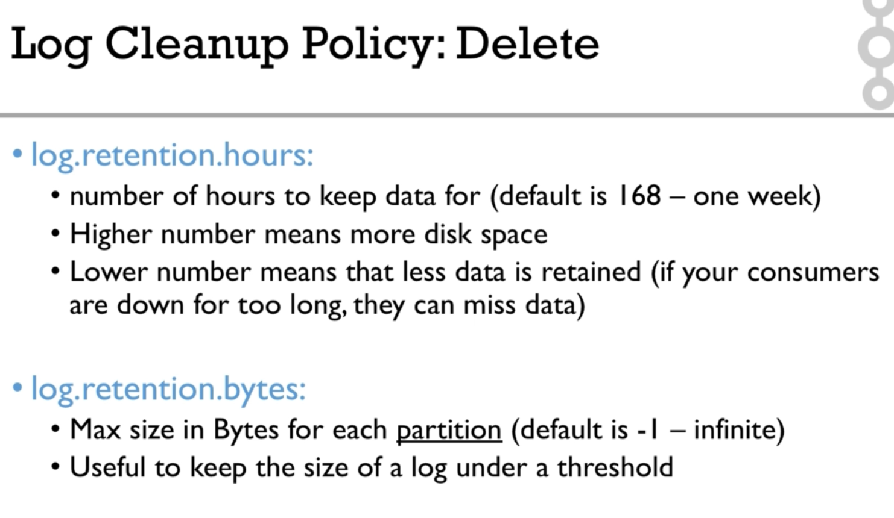

## Advanced Kafka topic configuration 


## To list config of a Kafka topic

```
kafka-configs.sh --zookeeper 127.0.0.1:2181 --entity-type topics --entity-name configured-topic --describe 
```

## To list all the config that are available for an entity

```
kafka-configs.sh --zookeeper 127.0.0.1:2181 --entity-type topics --entity-name configured-topic --add-config
```

## To change a config of an entity ( say topic ) 

```
kafka-configs.sh --zookeeper 127.0.0.1:2181 --entity-type topics --entity-name configured-topic --add-config min.insync.replicas=2 --alter
```

## To delete a config 

```
kafka-configs.sh --zookeeper 127.0.0.1:2181 --entity-type topics --entity-name configured-topic --delete-config min.insync.replicas --alter
```





