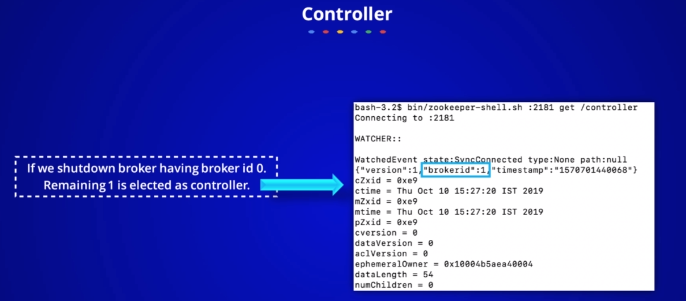
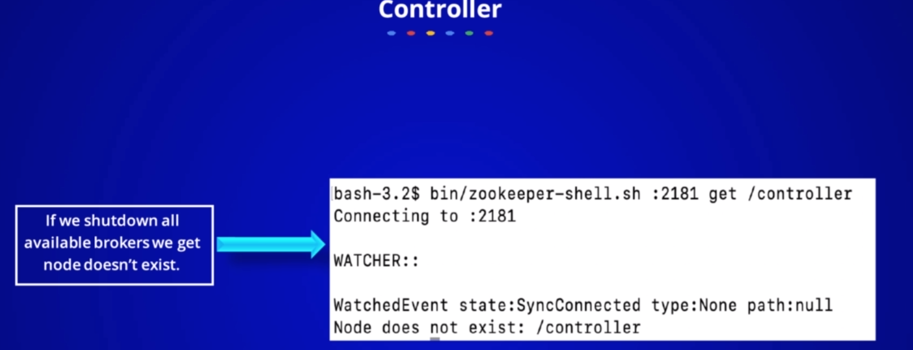
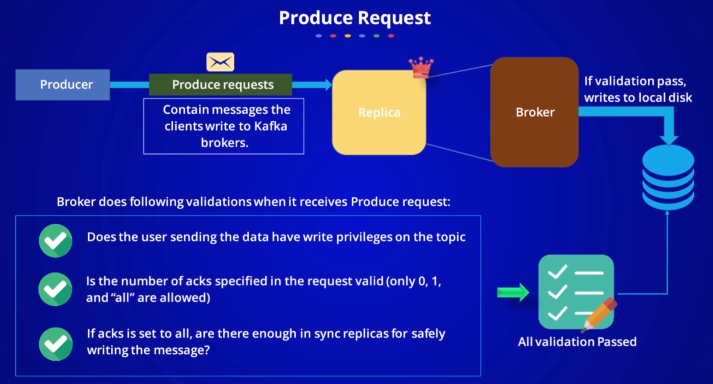
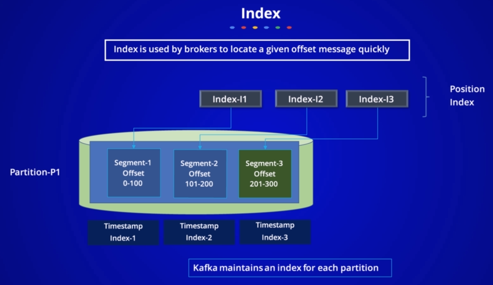
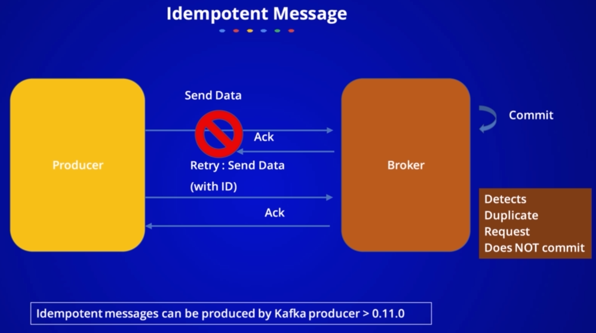

## Kafka Internals
   

## NOTES :

1) Lesser segment size => More Segment files per partition => More open file descriptors by Kafka

2) Kafka stores messages in disk not in RAM.

3) Storage architecture: 

## Articles

[What makes Apache Kafka so fast](https://www.freecodecamp.org/news/what-makes-apache-kafka-so-fast-a8d4f94ab145/)