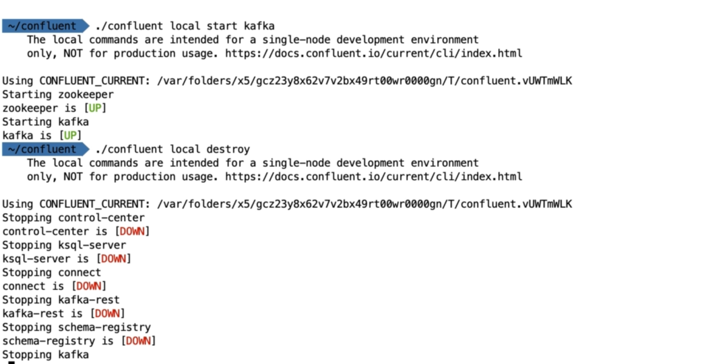
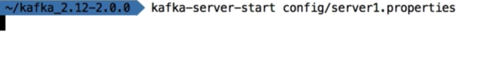

# Zookeeper and Kafka Installation steps

1) Install openjdk package 

```
sudo apt-get install openjdk-11-jdk
```

2) Download Kafka tar file 

```
https://kafka.apache.org/downloads
```

3) Extract the downloaded tar and add the `bins` directory to `$PATH`.

4) Create a directory `data/zookeeper` under it.

```
mkdir -p /home/prateek/Softwares/kafka_2.13-2.7.0/data/zookeeper
```

5) Add zookeper location in `config/zookeeper.properties`.

```
...
dataDir=/home/prateek/Softwares/kafka_2.13-2.7.0/data/zookeeper
# the port at which the clients will connect
clientPort=2181
...
```

6) Start the Zookeeper

```
zookeeper-server-start.sh config/zookeeper.properties
```

7) Create a `kafka` directory under `data`

```
mkdir -p /home/prateek/Softwares/kafka_2.13-2.7.0/data/kafka
```

8) Edit `config/server.properties` and add kafka data path in `log.dirs` entry.

```
# A comma separated list of directories under which to store log files
log.dirs=/home/prateek/Softwares/kafka_2.13-2.7.0/data/kafka
```

9) Start the Kafka

```
kafka-server-start.sh config/server.properties 
```

## Other Options to run Kafka

1) __Confluent CLI : Single node development environment setup__ :



2) __Multi broker setup__ :

    i) Copy 2 more copies of `server.properties`.

    

    ii) Change the `broker.id` and `log.dirs` each each of the `server.properties` . Also assign a diffrent port to each server.

    

    

    

    

    

    iii) Create data directory for each of the server

    

    iv) Start the Zookeeper.

    

    v) Run the 3 servers by providing corresponding `server.properties` file.

    

    

    

    vi) Verify multiple brokers are available.

    

3) __Using Docker__ : https://github.com/conduktor/kafka-stack-docker-compose