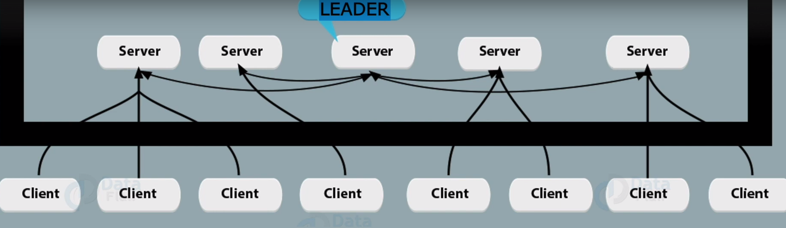

## Zookeeper

- Kafka utilizes Zookeeper for storing metadata information about the brokers, topics, and partitions. Writes to Zookeeper are only performed on changes to the member‐ship of consumer groups or on changes to the Kafka cluster itself. This amount of
traffic is minimal, and it does not justify the use of a dedicated Zookeeper ensemble

## Zookeeper architecture

- One of the nodes ( Zookeeper Servers) will be elected as a leader. Based on some voting and leader election algorithm.

- Leader distributes work to other nodes.

- If a client request will change the state of ZK , then leader will decide whether to process this request and which ZK server
will handle it.

- It is recommended that ZK server nodes should be in odd numbers ( 1 or 3 or 5, ...)

## System requirements

1. Java 8 or higher

2. RAM : Minimum 1 GB ( for 3 ZK nodes)

