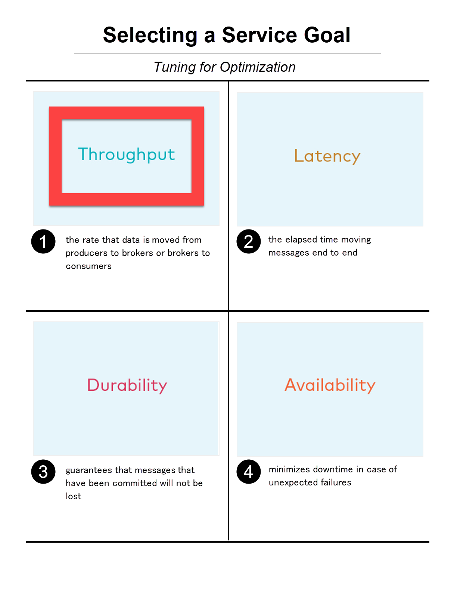

## Module 01 : Throughput

- Optimizing for throughput means the rate that data is moved from producers to brokers or brokers to consumers is a priority.

### Producer:

batch.size: increase to 100000 – 200000 (default 16384)

linger.ms: increase to 10 – 100 (default 0)

compression.type=lz4 (default none, i.e., no compression)

acks=1 (default all for CP versions >= 7.x or AK versions >= 3.x)

buffer.memory: increase if there are a lot of partitions (default 33554432)

### Consumer:

fetch.min.bytes: increase to ~100000 (default 1)


### Evaluate Compression Strategy'

You can also easily enable compression, which means a lot of bits can be sent as fewer bits. Enable compression by configuring the `compression.type` parameter, which can be set to one of the following standard compression codecs: `lz4, snappy, zstd, and gzip`. For performance, we generally recommend lz4 and avoid gzip because it can be a CPU hog. Compression is applied on full batches of data, so the efficacy of batching will also impact the compression ratio—more batching results in better compression ratios. When the broker receives a compressed batch of messages from a producer, it always decompresses the data to validate it. Afterward it considers the compression codec of the destination topic.

If the compression codec of the destination topic is left at the default setting of producer, or if the codecs of the batch and destination topic are the same, the broker takes the compressed batch from the client and writes it directly to the topic’s log file without taking cycles to recompress the data.

Otherwise, the broker needs to recompress the data to match the codec of the destination topic, and this can result in a performance impact, therefore keep the compression codecs the same if possible.

Decompression and recompression can also happen if producers are running a version prior to 0.10 because offsets need to be overwritten, or if any other message format conversion is required. But otherwise, as long as you are running updated clients and `log.message.format.version` is up to date, no message conversion is necessary.

### NOTES

- You can tune the consumers for higher throughput by adjusting how much data it gets from each fetch from the leader broker. You can increase how much data the consumers get from the leader for each fetch request by increasing the configuration parameter fetch.min.bytes. This parameter sets the minimum number of bytes expected for a fetch response from a consumer. Increasing this will also reduce the number of fetch requests made to the broker, reducing the broker CPU overhead to process each fetch, thereby also improving throughput. Similar to the consequence of increasing batching on the producer, there may be a resulting tradeoff to higher latency when increasing this parameter on the consumer. This is because the broker won’t send the consumer new messages until the fetch request has enough messages to fulfill the size of the fetch request, i.e., `fetch.min.bytes`, or until the expiration of the wait time, i.e., configuration parameter `fetch.max.wait.ms`.

- Assuming the application allows it, use consumer groups with multiple consumers to parallelize consumption. Parallelizing consumption may improve throughput because multiple consumers can balance the load, processing multiple partitions simultaneously. The upper limit on this parallelization is the number of partitions in the topic.

- Finally, if you have a Java client, you should consider two more points. If you are using SSL/TLS, both Java 8 and Java 11 are supported, but you should ideally run Java 11 to leverage the SSL performance improvements that were introduced in Java 9.

- Additionally, you should tune the JVM to minimize garbage collection (GC) pause time. GC is essential because it deletes unused objects and reclaims memory. However, long GC pauses are undesirable because they can negatively impact throughput and at worst case cause a broker soft failure, e.g., an expired ZooKeeper session timeout. 

### Running producer performance test

```
kafka-producer-perf-test \
    --topic performance \
    --num-records 1000000 \
    --record-size 5000 \
    --throughput -1 \
    --producer-props \
    bootstrap.servers=kafka-1:19092 \
    <VARIABLE_HERE>
```

Example :

```
kafka-producer-perf-test \
    --topic performance \
    --num-records 1000000 \
    --record-size 5000 \
    --throughput -1 \
    --producer-props \
    bootstrap.servers=kafka-1:19092 \
    acks=all
```

## Module 02 : Latency

### Good to know: Settings for Optimal Latency

#### Producer :

linger.ms=0 (default 0)

compression.type=none (default none, i.e., no compression)

acks=1 (default all for CP versions >= 7.x or AK versions >= 3.x)

#### Consumer 

fetch.min.bytes=1 (default 1)

#### Streams:

StreamsConfig.TOPOLOGY_OPTIMIZATION: StreamsConfig.OPTIMIZE (default StreamsConfig.NO_OPTIMIZATION)

Streams applications have embedded producers and consumers, so also check those configuration recommendations

#### Broker

num.replica.fetchers: increase if followers can’t keep up with the leader (default 1)

### NOTES

- Because a partition is a unit of parallelism in Kafka, an increased number of partitions may increase throughput. However, there is a tradeoff in that an increased number of partitions may also increase latency. A broker by default uses a single thread to replicate data from another broker, so it may take longer to replicate a lot of partitions shared between each pair of brokers and consequently take longer for messages to be considered committed. No message can be consumed until it is committed, so this can ultimately increase end-to-end latency.

## Module 03: Durability

### Good to know: Settings for Optimal Durability

#### Producer:

replication.factor=3 (topic override available)

acks=all (default all for CP versions >= 7.x or AK versions >= 3.x)

enable.idempotence=true (default true for CP versions >= 7.x or AK versions >= 3.x), to handle message duplication and ordering

max.in.flight.requests.per.connection=1 (default 5), to prevent out of order messages when not using an idempotent producer

#### Consumer:

enable.auto.commit=false (default true)

isolation.level=read_committed (when using EOS transactions)

#### Streams:

StreamsConfig.REPLICATION_FACTOR_CONFIG: 3 (default 1)

StreamsConfig.PROCESSING_GUARANTEE_CONFIG: StreamsConfig.EXACTLY_ONCE (default StreamsConfig.AT_LEAST_ONCE)

Streams applications have embedded producers and consumers, so also check those configuration recommendations

#### Broker:

default.replication.factor=3 (default 1)

auto.create.topics.enable=false (default true)

min.insync.replicas=2 (default 1); topic override available

unclean.leader.election.enable=false (default false); topic override available

broker.rack: rack of the broker (default null)

log.flush.interval.messages, log.flush.interval.ms: for topics with very low throughput, set message interval or time interval low as needed (default allows the OS to control flushing); topic override available

#### Producer-Related Configuration Settings

- Durability is important not just for user-defined topics, but also Kafka internal topics. Ensure all internal topics have the appropriate replication factor configured. These topics include:

    - Consumer offsets topic: This topic, by default called __consumer_offsets, tracks the offsets of messages that have been consumed. If you are running a Kafka version with KIP-115, it will enforce offsets.topic.replication.factor upon the consumer offsets topic during auto topic creation.

    - Kafka Streams application internal topics: These topics are created by the Kafka Streams application and used internally while executing, for example, the changelog topics for state stores and repartition topics. Its configuration setting replication.factor is configured to 1 by default, so you may need to increase it.

    - EOS transaction state log topic: If you are using exactly once semantics (EOS), the transaction state log topic stores the latest state of a transaction, e.g., “Ongoing,” “Prepare commit,” and “Completed,” and associated metadata. Its configuration setting transaction.state.log.replication.factor is configured to 3 by default.

- Producers can also increase durability by trying to resend messages if any sends fail to ensure that data is not lost. The producer automatically tries to resend messages up to the number of times specified by the configuration parameter retries (default MAX_INT) and up to the time duration specified by the configuration parameter delivery.timeout.ms (default 120000), the latter of which was introduced in KIP-91. You can tune delivery.timeout.ms* to the desired upper bound for the total time between sending a message and receiving an acknowledgment from the broker, which should reflect business requirements of how long a message is valid for.

- There are two things to take into consideration with these automatic producer retries: duplication and message ordering.

    - __Duplication__: If there are transient failures in the cluster that cause a producer retry, the producer may send duplicate messages to the broker

    - __Ordering__: Multiple send attempts may be “in flight” at the same time, and a retry of a previously failed message send may occur after a newer message send succeeded

To address both of these, we generally recommend that you configure the producer for idempotency, i.e., `enable.idempotence=true`, for which brokers track messages using incrementing sequence numbers, similar to TCP. Idempotent producers can handle duplicate messages and preserve message order even with request pipelining—there is no message duplication because the broker ignores duplicate sequence numbers, and message ordering is preserved because when there are failures, the producer temporarily constrains to a single message in flight until sequencing is restored. In case the idempotence guarantees can’t be satisfied, the producer will raise a fatal error and reject any further sends, so when configuring the producer for idempotency, the application developer needs to catch the fatal error and handle it appropriately.

- However, if the producer is configured with enable.idempotence=false but the business requirements necessitate it, you need to address the potential for message duplication and ordering issues in other ways. To handle possible message duplication if there are transient failures in the cluster, be sure to build your consumer application logic to process duplicate messages. To preserve message order while also allowing resending failed messages, set the configuration parameter `max.in.flight.requests.per.connection=1` to ensure that only one request can be sent to the broker at a time.

- Note that producer idempotency tracks message sequence numbers, which makes sense only when automatic retries are enabled. Otherwise, if you set retries=0 and the application manually tries to resend a failed message, then it just generates a new sequence number so the duplication detection won’t work. Disabling automatic retries can result in message gaps due to individual send failures, but the broker will preserve the order of writes it receives.

#### Consumer-related settings

- You can configure how commits happen with the configuration parameter `enable.auto.commit`. By default, offsets are configured to be automatically committed during the consumer’s `poll()` call at a periodic interval. But if the consumer is part of a transactional chain and you need strong message delivery guarantees, you want the offsets to be committed only after the consumer finishes completely processing the messages. Thus, for durability, disable the automatic commit by setting `enable.auto.commit=false` and explicitly call one of the commit methods in the consumer code (e.g., `commitSync()` or `commitAsync()`).

- For even stronger guarantees, you may configure your applications for EOS transactions, which enable atomic writes to multiple Kafka topics and partitions. Since some messages in the log may be in various states of a transaction, consumers can set the configuration parameter `isolation.level` to define the types of messages they should receive. By setting `isolation.level=read_committed`, consumers will receive only non-transactional messages or committed transactional messages, and they will not receive messages from open or aborted transactions. To use transactional semantics in a `consume-process-produce` pattern and ensure each message is processed exactly once, a client application should set `enable.auto.commit=false` and should not commit offsets manually, instead using the `sendOffsetsToTransaction()` method in the `KafkaProduce` interface. You may also enable exactly once for your streaming applications by setting the configuration parameter `processing.guarantee`.

#### Broker-related configuration settings

- The rack awareness feature spreads replicas of the same partition across different racks. This limits the risk of data loss in case all the brokers on a rack fail at once. This feature can also be applied to cloud-based solutions like Amazon’s EC2 by assigning brokers to different availability zones. You can specify which rack a broker belongs to by setting the configuration parameter `broker.rack`, and then Kafka will automatically ensure that replicas span as many racks as they can.

- If there are broker failures, the Kafka cluster can automatically detect the failures and elect new partition leaders. The configuration parameter `unclean.leader.election.enable` indicates whether brokers in the ISR list which are not caught up to the leader (i.e., “unclean”) are eligible to become leaders themselves. For higher durability, this should be disabled by setting `unclean.leader.election.enable=false` to ensure that new leaders should be elected from just the ISR list. This prevents the chance of losing messages that were committed but not replicated. 

- The tradeoff is tolerating more downtime until the other replicas come in sync. Because we recommend that you use Kafka’s replication for durability and allow the operating system to control flushing data from the page cache to disk, you generally should not need to change the flush settings. However, for critical topics with extremely low throughput rates, there may be a longer period of time before the OS flushes to disk. For topics like those, you may consider tuning either `log.flush.interval.ms` or `log.flush.interval.messages` to be small. For example, if you want to persist to disk synchronously after every message, you can set log.flush.interval.messages=1.

## Module 04: Availability

- Optimizing for availability means minimal downtime in case of unexpected failures. 

- To optimize for high availability, you should tune Kafka to recover as quickly as possible from failure scenarios.

### Good to know: Settings for Optimal Availability

#### Consumer:

session.timeout.ms: as low as feasible (default 45000)

#### Streams:

StreamsConfig.NUM_STANDBY_REPLICAS_CONFIG: 1 or more (default 0)

Streams applications have embedded producers and consumers, so also check those configuration recommendations

#### Broker:

unclean.leader.election.enable=true (default false); topic override available

min.insync.replicas=1 (default 1); topic override available

num.recovery.threads.per.data.dir: number of directories in log.dirs (default 1)

### Determine Availability Goals

- Higher partition counts may increase parallelism, but having more partitions can also increase recovery time in the event of a broker failure. All produce and consume requests will pause until the leader election completes, and these leader elections happen per partition. So, take this recovery time into consideration when choosing partition counts.

### Consumer-related settings

- On the consumer side, consumers can share processing load by being a part of a consumer group. If a consumer unexpectedly fails, Kafka can detect the failure and rebalance the partitions amongst the remaining consumers in the consumer group.

- The consumer liveness is maintained with a heartbeat, now in a background thread since KIP-62, and the timeout used to detect failed heartbeats is dictated by the configuration parameter `session.timeout.ms`. The lower the session timeout is set, the faster a failed consumer will be detected, which will decrease the time to recovery in the case of a failure. Set this as low as possible to detect hard failures but not so low that soft failures occur. Soft failures occur most commonly in two scenarios: when a batch of messages returned by `poll()` takes too long to process or when a JVM GC pause takes too long. If you have a `poll()` loop that spends too much time processing messages, you can address this either by increasing the upper bound on the amount of time that a consumer can be idle before fetching more records with `max.poll.interval.ms` or by reducing the maximum size of batches returned with the configuration parameter `max.poll.records`.

### Streams-specific configuration settings

When rebalancing workloads by moving tasks between event streaming application instances, you can reduce the time it takes to restore task processing state before the application instance resumes processing. In Kafka Streams state restoration is usually done by replaying the corresponding changelog topic to reconstruct the state store. The application can replicate local state stores to minimize changelog-based restoration time, by setting the configuration parameter `num.standby.replicas`. Thus, when a stream task is initialized or re-initialized on the application instance, its state store is restored to the most recent snapshot accordingly:

If a local state store does not exist, i.e., `num.standby.replicas=0`, the changelog is replayed from the earliest offset.

If a local state store does exist, i.e., `num.standby.replicas` is greater than 0, the changelog is replayed from the previously checkpointed offset. This method takes less time because it is applying a smaller portion of the changelog.

### Broker-related configuration settings

- On the other hand, by setting this value low (e.g., min.insync.replicas=1), the system will tolerate more replica failures. As long as the minimum number of replicas is met, the producer requests will continue to succeed, which increases availability for the partition.

- to optimize for high availability, new leaders can be allowed to be elected even if they were removed from the ISR list. To make this happen, set the configuration parameter `unclean.leader.election.enable=true`. This makes leader election happen more quickly, which increases overall availability.

- When a broker is started up, the broker scans its log data files in preparation for getting in sync with other brokers. This process is called log recovery. The number of threads per data directory to be used for log recovery at startup and log flushing at shutdown is defined by the configuration parameter `num.recovery.threads.per.data.dir`. Brokers with thousands of log segments will have a large number of index files, which can cause the log loading process on broker startup to be slow. If you are using RAID (high performance with fault tolerance), then increasing `num.recovery.threads.per.data.dir` to the number of disks may reduce the log loading time.